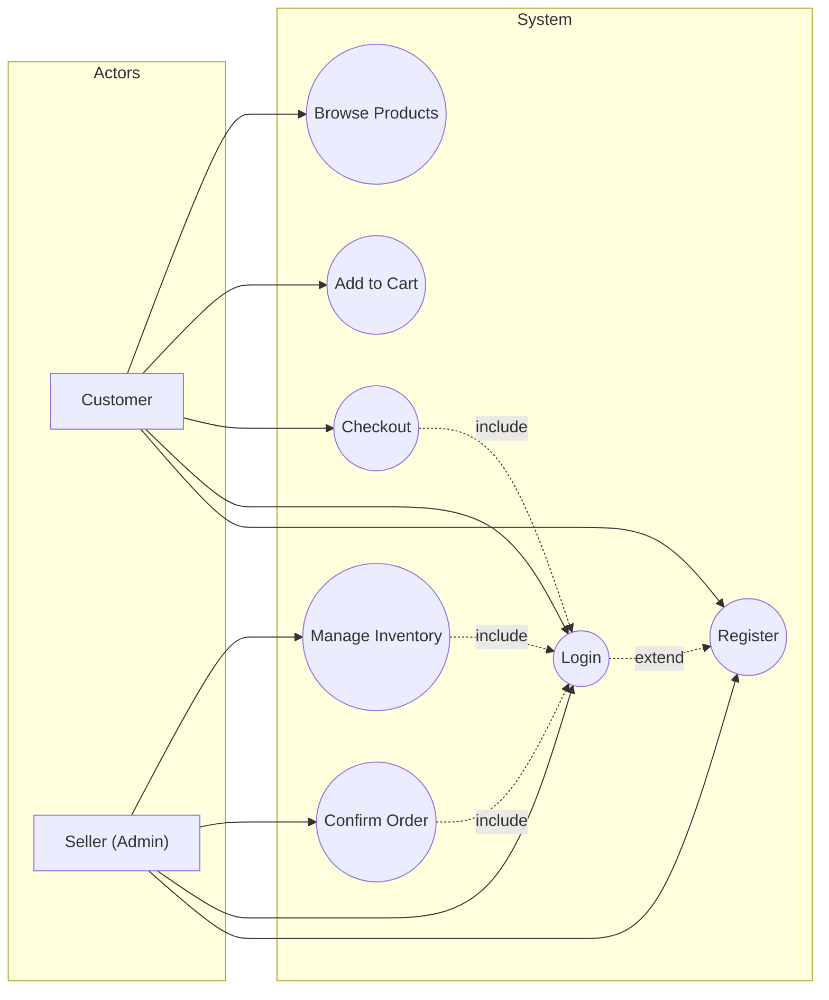
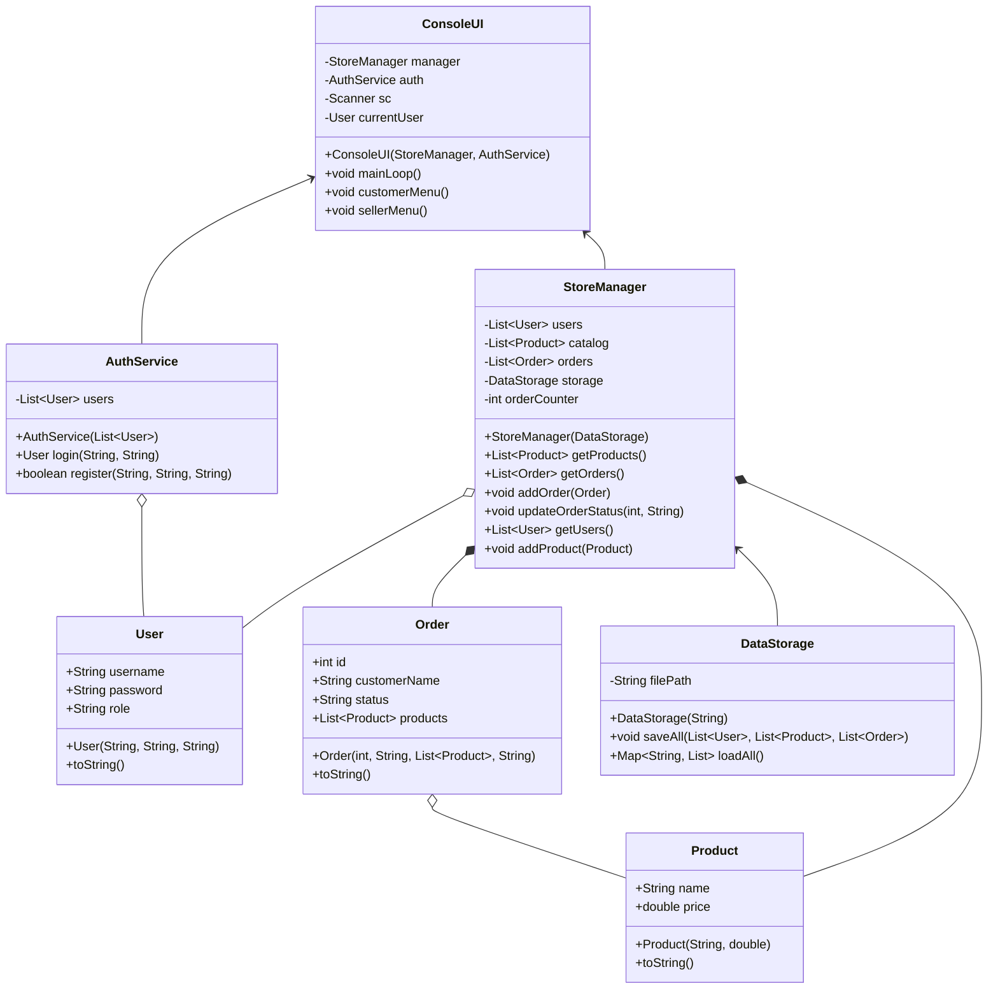
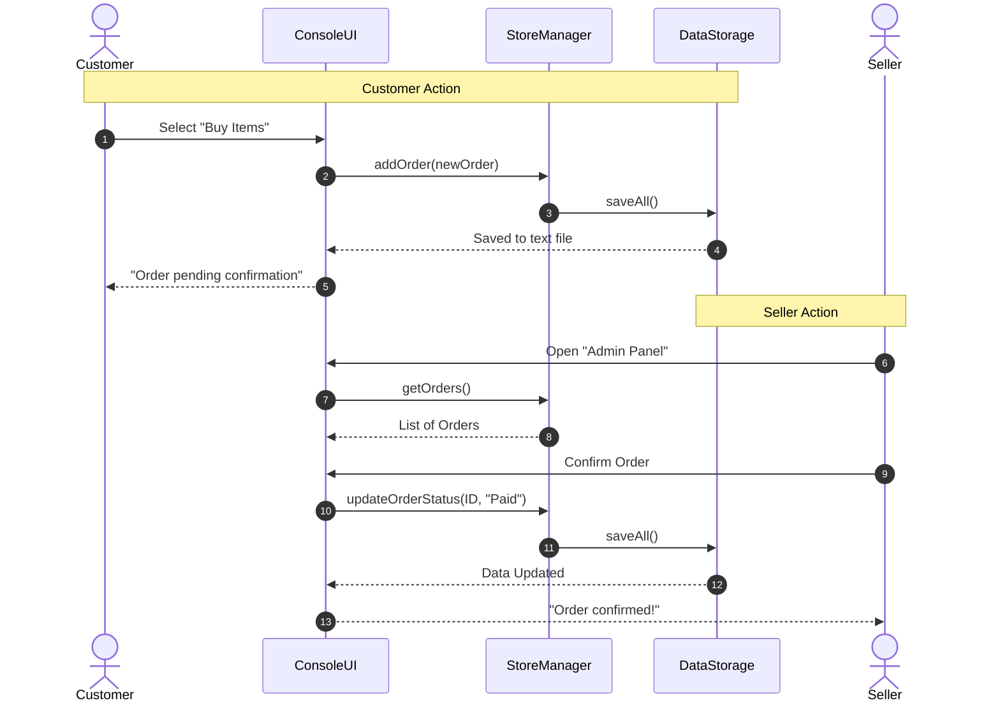

# Store Management System

This project is a simple console-based store management system written in Java. It allows customers to browse products, add them to a cart, and place orders, while sellers (admins) can manage inventory and confirm orders. All data is saved to a text file.

## Features
- User registration and login (Customer or Seller)
- Product catalog browsing
- Shopping cart and order placement for customers
- Inventory management and order confirmation for sellers
- Data persistence to a text file

## How to Run
1. Make sure you have Java (version 21 or higher) and Maven installed.
2. Open a terminal in the project directory.
3. Build the project:
    ```bash
    mvn clean package
    ```
4. Run the application:
    ```bash
    java -cp target/umlproject-1.0-SNAPSHOT.jar com.github.arsenmonets.ConsoleUI
    ```

**UML Diagrams**

### Use Case Diagram

**Actors:**

- **Customer**: A user who can browse products, add them to the cart, place orders, and register/login to the system.
- **Seller (Admin)**: A user with administrative rights who can manage the product inventory, confirm orders, and also register/login.




### Class Diagram



### Sequence Diagram

**Scenario Descriptions:**

- **Customer scenario:**
    1. Customer selects "Buy Items" in the UI.
    2. The UI creates a new order and sends it to the StoreManager.
    3. StoreManager saves all data via DataStorage.
    4. DataStorage confirms saving to the UI.
    5. UI notifies the customer that the order is pending confirmation.

- **Seller scenario:**
    1. Seller opens the "Admin Panel" in the UI.
    2. UI requests the list of orders from StoreManager.
    3. StoreManager returns the list to the UI.
    4. Seller selects an order to confirm.
    5. UI updates the order status via StoreManager.
    6. StoreManager saves all data via DataStorage.
    7. DataStorage confirms update to the UI.
    8. UI notifies the seller that the order is confirmed.


## StoreManagerTest: Test Descriptions

1. **testRegisterAndLogin** — checks that a user can register and log in, and that the user's data is stored correctly.
2. **testRegisterDuplicate** — checks that it is not possible to register two users with the same username.
3. **testAddProduct** — checks that after adding a product, the number of products in the store increases by 1.
4. **testAddOrder** — checks that after adding an order, the number of orders in the store increases by 1.
5. **testUpdateOrderStatus** — checks that the status of an order can be changed (e.g., from "Pending" to "Paid").
6. **testGetUsers** — checks that it is possible to get the list of users and add a new user to this list.
7. **testProductToString** — checks that the toString() method in Product returns a string containing the product name.
8. **testOrderToString** — checks that the toString() method in Order returns a string containing the customer's name.
9. **testUserToString** — checks that the toString() method in User returns a string containing the username.
10. **testLoginFail** — checks that logging in with a non-existent user returns null (failure).