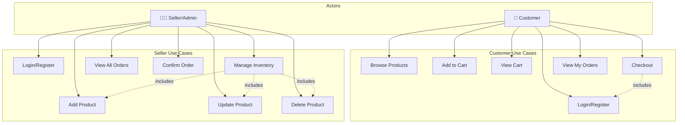
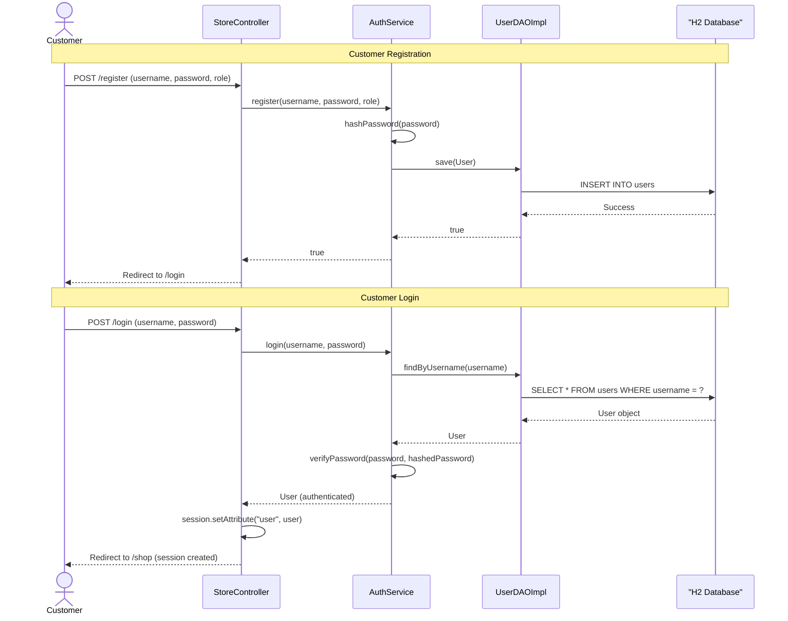
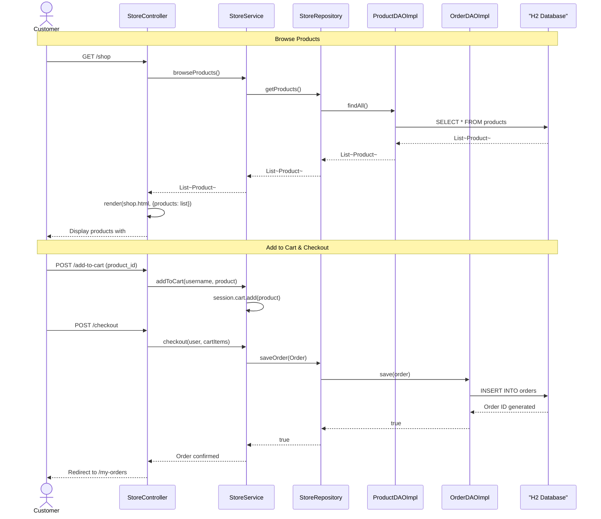
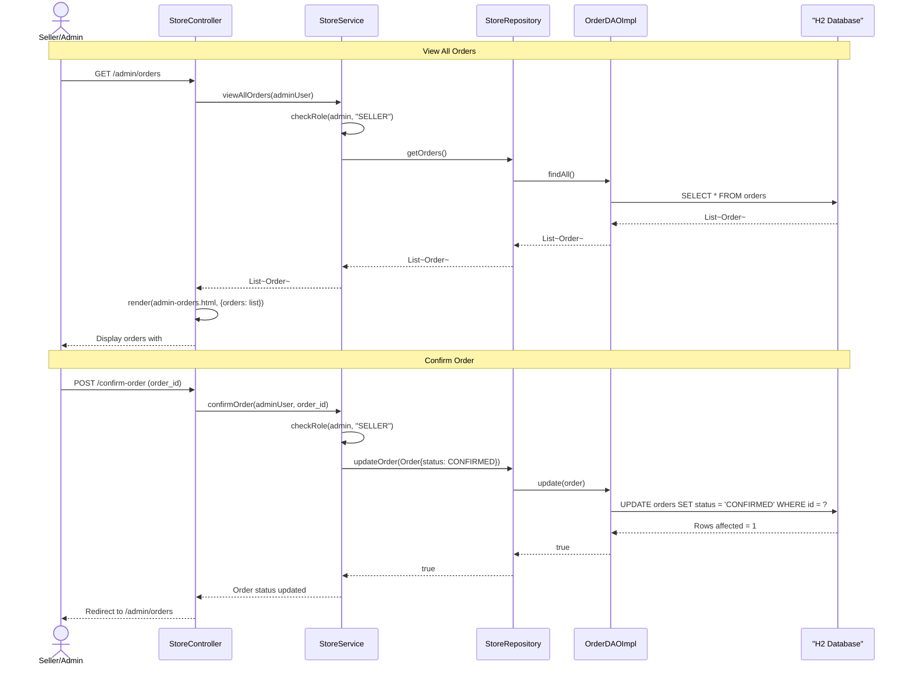
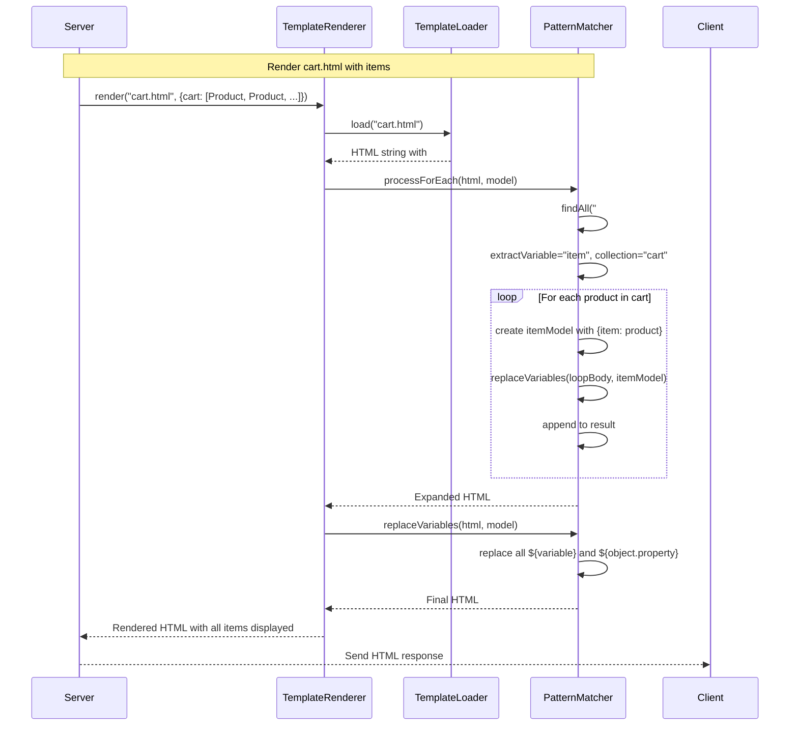

# Store Management System

A web-based store management system written in Java with Javalin framework. It allows customers to browse products, add them to a cart, and place orders, while sellers (admins) can manage inventory and confirm orders. All data is persisted in an H2 database.

## Features

- **User Management**: Registration and login for both customers and sellers
- **Product Browsing**: Customers can browse and search the product catalog
- **Shopping Cart**: Add/remove products from cart and proceed to checkout
- **Order Management**: Customers can place orders; sellers can confirm pending orders
- **Inventory Management**: Sellers can add, update, and delete products
- **Data Persistence**: All data stored in H2 in-memory database with schema initialization
- **Security**: BCrypt password hashing and role-based access control
- **Server-Side Rendering**: HTML templates with dynamic variable binding and loop support

## Project Structure

```
src/
├── main/java/com/github/arsenmonets/
│   ├── Application.java                 # Main entry point with Javalin setup
│   ├── controller/
│   │   ├── RouteHandler.java           # HTTP route definitions
│   │   └── StoreController.java         # Request handling and routing
│   ├── service/
│   │   ├── AuthService.java            # Authentication logic
│   │   └── StoreService.java           # Business logic layer
│   ├── dao/
│   │   ├── interfaces (UserDAO, ProductDAO, OrderDAO)
│   │   └── impl/ (implementations using H2 database)
│   ├── models/
│   │   ├── User.java
│   │   ├── Product.java
│   │   └── Order.java
│   ├── repository/
│   │   └── StoreRepository.java         # Data access abstraction
│   ├── database/
│   │   └── DatabaseConnection.java      # Singleton database connection
│   ├── exception/
│   │   └── AuthenticationException.java
│   ├── util/
│   │   └── PasswordUtil.java           # BCrypt hashing utilities
│   └── view/
│       ├── TemplateLoader.java          # Load HTML templates
│       └── TemplateRenderer.java        # Render templates with variable binding
├── resources/templates/
│   ├── home.html, login.html, register.html
│   ├── shop.html, cart.html
│   ├── my-orders.html
│   ├── admin-orders.html, admin-products.html
└── test/
    ├── AuthServiceTest.java (Unit tests)
    ├── StoreServiceTest.java (Unit tests)
    ├── AuthServiceIntegrationTest.java (Integration tests)
    └── StoreServiceIntegrationTest.java (Integration tests)
```

## Architecture Overview

### Layered Architecture

The application follows a **Layered Architecture** pattern with clear separation of concerns:

```
┌─────────────────────────────────────┐
│   View Layer (HTML Templates)       │  - Dynamic template rendering with ${var} and #foreach loops
├─────────────────────────────────────┤
│   Controller Layer (Javalin Routes) │  - HTTP request handling, routing, session management
├─────────────────────────────────────┤
│   Service Layer (Business Logic)    │  - Use case orchestration, role-based access control
├─────────────────────────────────────┤
│   Repository Layer (DAOs)           │  - Data access abstraction with interfaces
├─────────────────────────────────────┤
│   Database Layer (H2 JDBC)          │  - SQL execution, connection management
└─────────────────────────────────────┘
```

### Design Patterns Used

#### 1. **Singleton Pattern** (Creational)
- **Class**: `DatabaseConnection`
- **Purpose**: Ensures only one database connection instance exists application-wide
- **Implementation**: Private constructor, static `getInstance()` method with lazy initialization and synchronized block for thread safety
- **Benefits**: Centralized connection management, resource efficiency, prevents connection leaks

```java
public class DatabaseConnection {
    private static DatabaseConnection instance;
    private Connection connection;
    
    private DatabaseConnection() { /* initialization */ }
    
    public static synchronized DatabaseConnection getInstance() {
        if (instance == null) {
            instance = new DatabaseConnection();
        }
        return instance;
    }
}
```

#### 2. **DAO (Data Access Object) Pattern** (Structural)
- **Classes**: `UserDAO`, `ProductDAO`, `OrderDAO` (interfaces) with `*DAOImpl` implementations
- **Purpose**: Abstracts database operations and decouples business logic from database details
- **Implementation**: Interface defines contract; implementations use JDBC to interact with H2 database
- **Benefits**: Easy testing with mocks, database independence, cleaner separation of concerns

```java
public interface UserDAO {
    boolean save(User user);
    User findByUsername(String username);
    List<User> findAll();
    boolean update(User user);
    boolean delete(String username);
}

public class UserDAOImpl implements UserDAO {
    private Connection connection;
    // SQL operations...
}
```

#### 3. **Template Method Pattern** (Behavioral)
- **Class**: `TemplateRenderer`
- **Purpose**: Defines skeleton of template rendering process; concrete steps can be redefined by subclasses or methods
- **Implementation**: `render()` method defines steps: load template → process foreach loops → replace variables
- **Benefits**: Reusable rendering pipeline, consistent template processing

```java
public class TemplateRenderer {
    public static String render(String template, Map<String, Object> model) {
        String html = TemplateLoader.load(template);        // Step 1: Load
        html = processForEach(html, model);                 // Step 2: Process loops
        html = replaceVariables(html, model);               // Step 3: Replace variables
        return html;
    }
}
```

#### 4. **MVC (Model-View-Controller) Pattern** (Architectural)
- **Model**: `User`, `Product`, `Order` classes managed via DAOs
- **View**: HTML templates (`home.html`, `shop.html`, `cart.html`, `my-orders.html`, `admin-*.html`)
- **Controller**: `StoreController` routes requests and delegates to services
- **Benefits**: Clear separation of presentation, business logic, and data layers

#### 5. **Facade Pattern** (Structural)
- **Class**: `StoreService` (Service Layer)
- **Purpose**: Provides simplified unified interface to complex subsystems (multiple DAOs, authentication)
- **Implementation**: Single service class coordinates UserDAO, ProductDAO, OrderDAO, and AuthService
- **Benefits**: Hides complexity, provides clean API for controllers

#### 6. **Decorator Pattern** (Structural)
- **Class**: `RouteHandler`
- **Purpose**: Dynamically adds behavior (authentication, error handling, template rendering) to request handlers without modifying original handler code
- **Implementation**: Wraps handler functions with `handle()` and `handleAuthenticated()` methods that add cross-cutting concerns
- **Key Behaviors**:
  - **Exception Handling**: Catches and responds to `NumberFormatException`, `AuthenticationException`, `IllegalAccessError`, `IllegalArgumentException`
  - **Authentication Decoration**: `handleAuthenticated()` wraps handlers and injects authenticated `User` object
  - **Template Rendering Decoration**: `renderWithUser()` and `renderTemplate()` decorate context responses with rendered HTML
- **Benefits**: Separation of concerns, reusable handler decorations, consistent error handling across all routes

```java
public class RouteHandler {
    // Decorator: Adds exception handling to any handler
    public void handle(Context ctx, Consumer<Context> handler) {
        try {
            handler.accept(ctx);
        } catch (AuthenticationException e) {
            respondUnauthorized(ctx, e);
        } catch (IllegalArgumentException e) {
            respondBadRequest(ctx, e);
        } // ... more exception handling
    }
    
    // Decorator: Adds authentication check and error handling
    public void handleAuthenticated(Context ctx, BiConsumer<Context, User> handler) {
        try {
            User user = getSessionUser(ctx);
            if (user == null) {
                ctx.redirect("/login");
                return;
            }
            handler.accept(ctx, user);  // Decorated handler receives authenticated user
        } catch (AuthenticationException e) {
            respondUnauthorized(ctx, e);
        }
    }
    
    // Decorator: Adds user context and template rendering
    public void renderWithUser(Context ctx, String template, Map<String, Object> model) {
        User user = getSessionUser(ctx);
        model.put("user", user);  // Decorates model with user
        ctx.html(TemplateRenderer.render(template, model));  // Renders decorated response
    }
}
```

**Example Usage in StoreController:**
```java
app.get("/shop", ctx -> routeHandler.handle(ctx, this::shop));
// RouteHandler decorates this::shop with error handling

app.post("/checkout", ctx -> routeHandler.handleAuthenticated(ctx, this::checkout));
// RouteHandler decorates this::checkout with authentication check + error handling

private void shop(Context ctx) {
    List<Product> products = storeService.browseProducts();
    Map<String, Object> model = new HashMap<>();
    model.put("products", products);
    routeHandler.renderWithUser(ctx, "shop", model);
    // RouteHandler.renderWithUser decorates response with user + renders template
}
```

## Security Features

- **Password Hashing**: BCrypt with 12 rounds for secure password storage
- **Role-Based Access Control**: Customer vs. Seller roles with enforced permissions at service layer
- **Session Management**: User authentication tracked in HTTP session
- **Input Validation**: Form validation and parameter checking in controllers and services

## How to Run

### Prerequisites
- Java 21 or higher
- Maven 3.6+

### Build & Run
```bash
# Clone the repository
git clone https://github.com/ArsenMonets/umlproject.git
cd solidproject

# Build with Maven
mvn clean package

# Run the application
java -cp target/umlproject-1.0-SNAPSHOT.jar com.github.arsenmonets.Application
```

### Access the Application
- Open browser and navigate to `http://localhost:8080`
- Default admin credentials can be created via registration form

## Testing

The project includes comprehensive test coverage with **116 test cases**:

### Unit Tests (70 tests)
- **AuthServiceTest** (30 tests): Login/register validation, password handling, edge cases
- **StoreServiceTest** (40 tests): Cart operations, checkout flow, inventory management, role-based access

### Integration Tests (46 tests)
- **AuthServiceIntegrationTest** (11 tests): Real database authentication workflows
- **StoreServiceIntegrationTest** (35 tests): Complete shopping scenarios with real data persistence

### Run Tests
```bash
mvn test
```

### Technology Stack
- **Framework**: Javalin (lightweight web framework)
- **Database**: H2 (embedded SQL database)
- **Testing**: JUnit 5, Mockito 5.7.0
- **Password**: BCrypt via Spring Security Crypto
- **Build**: Maven 3
- **Java**: Version 21+

---

## UML Diagrams

### Use Case Diagram**Actors:**
- **Customer**: Browses products, manages shopping cart, places orders, views order history
- **Seller/Admin**: Manages product inventory, confirms pending orders, views all orders




### Class Diagram

Comprehensive class diagram showing all layers and relationships:

```mermaid
classDiagram
    %% ============ MODELS ============
    class User {
        -int id
        -String username
        -String password
        -String role
        +User(String, String, String)
        +getUsername() String
        +getPassword() String
        +getRole() String
        +setUsername(String) void
        +setPassword(String) void
        +toString() String
    }

    class Product {
        -int id
        -String name
        -double price
        +Product(int, String, double)
        +getId() int
        +getName() String
        +getPrice() double
        +setName(String) void
        +setPrice(double) void
        +toString() String
    }

    class Order {
        -int id
        -String customerName
        -String status
        -List~Product~ products
        +Order(int, String, List~Product~, String)
        +getId() int
        +getCustomerName() String
        +getStatus() String
        +getProducts() List
        +getProductCount() int
        +setStatus(String) void
        +toString() String
    }

    %% ============ DATABASE & CONNECTION ============
    class DatabaseConnection {
        -static DatabaseConnection instance
        -Connection connection
        -DatabaseConnection()
        +static getInstance() DatabaseConnection
        +getConnection() Connection
        +closeConnection() void
    }
    
    note for DatabaseConnection "Singleton Pattern: Ensures only one database connection instance exists"

    %% ============ DAO INTERFACES ============
    class UserDAO {
        <<interface>>
        +save(User) boolean
        +findByUsername(String) User
        +findAll() List~User~
        +update(User) boolean
        +delete(String) boolean
    }

    class ProductDAO {
        <<interface>>
        +save(Product) boolean
        +findByName(String) Product
        +findAll() List~Product~
        +findById(int) Product
        +update(Product) boolean
        +delete(int) boolean
    }

    class OrderDAO {
        <<interface>>
        +save(Order) boolean
        +findById(int) Order
        +findAll() List~Order~
        +findByCustomer(String) List~Order~
        +update(Order) boolean
        +delete(int) boolean
    }
    
    note for UserDAO "DAO Pattern: Abstracts database operations, enables testing with mocks"

    %% ============ DAO IMPLEMENTATIONS ============
    class UserDAOImpl {
        -Connection connection
        +UserDAOImpl()
        +save(User) boolean
        +findByUsername(String) User
        +findAll() List~User~
        +update(User) boolean
        +delete(String) boolean
    }

    class ProductDAOImpl {
        -Connection connection
        +ProductDAOImpl()
        +save(Product) boolean
        +findByName(String) Product
        +findAll() List~Product~
        +findById(int) Product
        +update(Product) boolean
        +delete(int) boolean
    }

    class OrderDAOImpl {
        -Connection connection
        +OrderDAOImpl()
        +save(Order) boolean
        +findById(int) Order
        +findAll() List~Order~
        +findByCustomer(String) List~Order~
        +update(Order) boolean
        +delete(int) boolean
    }

    %% ============ REPOSITORY LAYER ============
    class StoreRepository {
        -UserDAO userDAO
        -ProductDAO productDAO
        -OrderDAO orderDAO
        +StoreRepository(UserDAO, ProductDAO, OrderDAO)
        +getUsers() List~User~
        +getProducts() List~Product~
        +getOrders() List~Order~
        +getOrdersByCustomer(String) List~Order~
        +saveUser(User) boolean
        +saveProduct(Product) boolean
        +saveOrder(Order) boolean
        +updateOrder(Order) boolean
        +updateProduct(Product) boolean
        +deleteProduct(int) boolean
    }
    
    note for StoreRepository "Facade Pattern: Simplifies access to multiple DAOs"

    %% ============ SERVICE LAYER ============
    class AuthService {
        -UserDAO userDAO
        +AuthService(UserDAO)
        +login(String, String) User
        +register(String, String, String) boolean
    }

    class StoreService {
        -StoreRepository storeRepository
        +StoreService(StoreRepository)
        +browseProducts() List~Product~
        +findProductByName(String) Product
        +addToCart(String, Product) void
        +viewCart(String) List~Product~
        +checkout(User, List~Product~) Order
        +viewMyOrders(User) List~Order~
        +viewAllOrders(User) List~Order~
        +confirmOrder(User, int) void
        +addProduct(User, Product) boolean
        +updateProduct(User, Product) boolean
        +deleteProduct(User, int) boolean
    }
    
    note for StoreService "Strategy & Facade Patterns: Encapsulates business logic, enforces role-based access"

    %% ============ CONTROLLER LAYER ============
    class RouteHandler {
        <<utility>>
        +handle(Context, Consumer) void
        +handleAuthenticated(Context, BiConsumer) void
        +renderWithUser(Context, String, Map) void
        +renderTemplate(Context, String, Map) void
        +getSessionUser(Context) User
        -respondAccessDenied(Context, Exception) void
        -respondUnauthorized(Context, Exception) void
        -respondBadRequest(Context, Exception) void
        -respondServerError(Context, Exception) void
    }
    
    note for RouteHandler "Decorator Pattern: Adds auth, error handling, rendering to handlers"

    class StoreController {
        -StoreService storeService
        -AuthService authService
        -RouteHandler routeHandler
        +StoreController(StoreService, AuthService)
        +handleHome(Context) void
        +handleLogin(Context) void
        +handleRegister(Context) void
        +handleLogout(Context) void
        +handleShop(Context) void
        +handleAddToCart(Context) void
        +handleCart(Context) void
        +handleCheckout(Context) void
        +handleMyOrders(Context) void
        +handleAdminOrders(Context) void
        +handleAdminProducts(Context) void
        +handleAddProduct(Context) void
        +handleConfirmOrder(Context) void
    }
    
    note for StoreController "MVC Controller: Routes HTTP requests, delegates to services"
    
    StoreController --> RouteHandler

    %% ============ VIEW LAYER ============
    class TemplateRenderer {
        <<utility>>
        +render(String, Map) String
        -processForEach(String, Map) String
        -replaceVariables(String, Map) String
        -getNestedValue(String, Map) Object
    }
    
    class TemplateLoader {
        <<utility>>
        +load(String) String
    }
    
    note for TemplateRenderer "Template Method Pattern: Renders templates with variable binding and loops"

    %% ============ UTILITY ============
    class PasswordUtil {
        <<utility>>
        +hashPassword(String) String
        +verifyPassword(String, String) boolean
    }

    %% ============ RELATIONSHIPS ============
    
    %% Database Connection relationships
    DatabaseConnection "1" -- "1" UserDAOImpl : uses
    DatabaseConnection "1" -- "1" ProductDAOImpl : uses
    DatabaseConnection "1" -- "1" OrderDAOImpl : uses

    %% DAO Interface implementations
    UserDAO <|.. UserDAOImpl
    ProductDAO <|.. ProductDAOImpl
    OrderDAO <|.. OrderDAOImpl

    %% DAO to Model relationships
    UserDAO --> User
    ProductDAO --> Product
    OrderDAO --> Order

    %% Repository to DAO relationships
    StoreRepository o-- UserDAO
    StoreRepository o-- ProductDAO
    StoreRepository o-- OrderDAO

    %% Service to Repository/DAO relationships
    AuthService o-- UserDAO
    StoreService --> StoreRepository

    %% Service to Model relationships
    AuthService --> User
    StoreService --> User
    StoreService --> Product
    StoreService --> Order

    %% Controller to Service relationships
    StoreController --> StoreService
    StoreController --> AuthService

    %% Controller to View relationships
    StoreController --> TemplateRenderer
    TemplateRenderer --> TemplateLoader

    %% Model relationships
    Order o-- Product
    User --> PasswordUtil
```



#### Key Architecture Points:
- **Single Responsibility**: Each class has one reason to change
- **Dependency Injection**: Services receive dependencies through constructors
- **Interface Segregation**: DAO interfaces define specific contracts
- **Loose Coupling**: Classes depend on abstractions (interfaces), not concrete implementations


### Sequence Diagrams

#### Scenario 1: Customer Registration and Login Flow



#### Scenario 2: Customer Shopping and Checkout Flow



#### Scenario 3: Admin Order Confirmation Flow



#### Scenario 4: Template Rendering with Dynamic Loops



## Database Schema

The H2 database is initialized with three main tables:

### Users Table
```sql
CREATE TABLE IF NOT EXISTS users (
    id INT AUTO_INCREMENT PRIMARY KEY,
    username VARCHAR(50) UNIQUE NOT NULL,
    password VARCHAR(255) NOT NULL,
    role VARCHAR(20) NOT NULL
);
```
- **id**: Auto-incremented unique identifier
- **username**: Unique username for login (50 chars max)
- **password**: BCrypt hashed password (255 chars for hash storage)
- **role**: Either "CUSTOMER" or "SELLER"

### Products Table
```sql
CREATE TABLE IF NOT EXISTS products (
    id INT AUTO_INCREMENT PRIMARY KEY,
    name VARCHAR(100) NOT NULL,
    price DECIMAL(10, 2) NOT NULL
);
```
- **id**: Auto-incremented product identifier
- **name**: Product name (100 chars max)
- **price**: Product price with 2 decimal places

### Orders Table
```sql
CREATE TABLE IF NOT EXISTS orders (
    id INT AUTO_INCREMENT PRIMARY KEY,
    customer_name VARCHAR(50) NOT NULL,
    status VARCHAR(20) NOT NULL,
    product_id INT,
    FOREIGN KEY (product_id) REFERENCES products(id)
);
```
- **id**: Auto-incremented order identifier
- **customer_name**: Name of customer who placed order
- **status**: Order status ("PENDING" or "CONFIRMED")
- **product_id**: Reference to product in order

## Code Structure Details

### Controller Layer - StoreController
**Responsibility**: Route HTTP requests to appropriate handlers, manage sessions, render templates

Routes handled:
- `GET /` → Home page
- `GET|POST /login` → User authentication
- `POST /logout` → Session termination
- `POST /register` → User registration
- `GET /shop` → Browse products
- `POST /add-to-cart` → Add product to cart (session-based)
- `GET /cart` → View shopping cart
- `POST /checkout` → Create order
- `GET /my-orders` → View customer's orders
- `GET /admin/orders` → View all orders (admin only)
- `POST /confirm-order` → Confirm order (admin only)
- `GET /admin/products` → View products (admin only)
- `POST /admin/add-product` → Add new product (admin only)
- `POST /admin/delete-product` → Delete product (admin only)

### Service Layer - StoreService
**Responsibility**: Business logic, role-based access control, use case orchestration

Key methods:
- `browseProducts()` - Retrieve all products for customers
- `findProductByName(String)` - Search products
- `addToCart(String, Product)` - Add item to session cart
- `viewCart(String)` - Retrieve cart items from session
- `checkout(User, List<Product>)` - Create order from cart items
- `viewMyOrders(User)` - Get customer's orders (role-based)
- `viewAllOrders(User)` - Get all orders (admin only)
- `confirmOrder(User, int)` - Update order status (admin only)
- `addProduct(User, Product)` - Add product (admin only)
- `updateProduct(User, Product)` - Modify product (admin only)
- `deleteProduct(User, int)` - Remove product (admin only)

Access control check pattern:
```java
if (!user.getRole().equals("SELLER")) {
    throw new AuthenticationException("Only sellers can confirm orders");
}
```

### Authentication Service - AuthService
**Responsibility**: User authentication and registration

Methods:
- `login(String username, String password)` - Authenticate user, verify password hash
- `register(String username, String password, String role)` - Create new user with hashed password

### DAO Layer
**Responsibility**: Database abstraction, CRUD operations on entities

#### UserDAOImpl
- Manages user records in database
- Implements password hash storage/retrieval
- Queries by username (unique constraint)

#### ProductDAOImpl
- Manages product inventory
- Implements price queries (used in tests with specific price lookups)
- Supports add/update/delete operations

#### OrderDAOImpl
- Manages order records with product references
- Queries orders by ID or customer name
- Maintains order status updates

### Template Engine - TemplateRenderer
**Responsibility**: Dynamic HTML rendering with variable substitution and looping

**Features**:
1. **Variable Binding**: `${variableName}` → replaced with model value
2. **Nested Property Access**: `${object.property}` → calls getter via reflection
3. **Collection Loops**: `#foreach(item in collection) ... #end` → iterates with item binding

**Processing Pipeline**:
```
Input HTML
    ↓
Load template file (TemplateLoader)
    ↓
Process #foreach loops (processForEach)
    ↓
Replace ${variables} (replaceVariables)
    ↓
Output rendered HTML
```

**Example Template Usage**:
```html
<h1>Your Cart (${cartSize}} items)</h1>
#foreach(product in cart)
  <tr>
    <td>${product.name}</td>
    <td>$${product.price}</td>
  </tr>
#end
<p>Total: $${total}</p>
```

## Test Suite Overview

### Unit Tests (70 test cases)

#### AuthServiceTest.java (30 tests)
Tests authentication logic with mocked UserDAO:

**Registration Tests:**
- `testSuccessfulRegistration` - Valid registration
- `testRegistrationWithDuplicateUsername` - Duplicate prevention
- `testRegistrationWithEmptyUsername` - Empty input validation
- `testRegistrationWithNullPassword` - Null safety
- `testRegistrationWithWhitespaceUsername` - Whitespace trimming

**Login Tests:**
- `testSuccessfulLogin` - Valid credentials
- `testLoginWithWrongPassword` - Password mismatch
- `testLoginWithNonexistentUser` - User not found
- `testLoginWithEmptyUsername` - Empty username handling
- `testLoginWithSpecialCharacterPassword` - Special character support

**Password Validation Tests:**
- `testPasswordHashingDifference` - Hash uniqueness
- `testPasswordVerificationWithSaltVariation` - Salt handling
- `testPasswordWithUnicode` - Unicode character support

#### StoreServiceTest.java (40 tests)
Tests business logic with mocked repositories:

**Shopping Tests:**
- `testBrowseProducts` - Retrieve product list
- `testFindProductByName` - Product search
- `testAddToCart` - Add item to session cart
- `testViewCart` - Retrieve cart contents
- `testClearCart` - Cart clearing
- `testCheckoutWithValidOrder` - Order creation
- `testCheckoutWithEmptyCart` - Empty cart validation

**Order Management Tests:**
- `testViewMyOrdersAsCustomer` - Customer order retrieval
- `testViewAllOrdersAsAdmin` - Admin order access
- `testViewAllOrdersAsCustomerThrowsException` - Role-based denial
- `testConfirmOrderAsAdmin` - Order confirmation
- `testConfirmOrderAsCustomerThrowsException` - Permission denial

**Product Management Tests:**
- `testAddProductAsAdmin` - Product creation
- `testAddProductAsCustomerThrowsException` - Permission check
- `testUpdateProductPrice` - Product modification
- `testDeleteProduct` - Product removal
- `testAddProductWithNegativePrice` - Price validation
- `testAddProductWithEmptyName` - Name validation

### Integration Tests (46 test cases)

#### AuthServiceIntegrationTest.java (11 tests)
Tests with real H2 database and UserDAOImpl:

- `testSuccessfulLoginWithValidCredentials` - Real database login
- `testRegistrationAndLoginWorkflow` - Complete user flow
- `testMultipleUsersCanRegisterAndLogin` - Multiple user persistence
- `testValidatePasswordMatchWithSpecialCharacters` - Real hash verification
- `testSamePasswordProducesDifferentHashes` - Salt randomness
- `testRegistrationFailsWithDuplicateUsername` - Unique constraint
- `testPasswordVerificationWithRealData` - Real password verification

#### StoreServiceIntegrationTest.java (35 tests)
Tests with real H2 database and all DAOs:

**Shopping Workflow Tests:**
- `testCompleteShoppingWorkflow` - Browse → Add → Checkout
- `testCustomerCanViewPersonalOrders` - Order retrieval
- `testMultipleCustomersCanCheckoutIndependently` - Data isolation
- `testAddProductToCartAndViewCart` - Cart persistence

**Admin Inventory Management Tests:**
- `testSellerCanAddProduct` - Product creation
- `testSellerCanUpdateProductPrice` - Price modification
- `testSellerCanDeleteProduct` - Inventory removal
- `testSellerCanViewAllOrders` - Admin order access
- `testSellerCanConfirmOrder` - Order confirmation
- `testSellerCannotDeleteProductAsCustomer` - Role-based denial

**Data Persistence Tests:**
- `testOrderPersistenceAfterCheckout` - Order saved to database
- `testProductPersistenceAfterCreation` - Product saved to database
- `testMultipleOrdersForSameCustomer` - Order history
- `testOrderStatusUpdatePersists` - Status changes saved

**Error Handling Tests:**
- `testCheckoutWithNullUser` - Null parameter handling
- `testCheckoutWithEmptyCart` - Empty cart validation
- `testAddProductWithInvalidData` - Invalid input rejection
- `testConfirmOrderWithInvalidId` - Order not found handling

### Running Tests
```bash
# Run all tests
mvn test

# Run specific test class
mvn test -Dtest=AuthServiceTest

# Run with verbose output
mvn test -X

# Skip tests during build
mvn package -DskipTests
```

## Design Patterns Summary

| Pattern | Class | Type | Purpose |
|---------|-------|------|---------|
| **Singleton** | DatabaseConnection | Creational | Single database connection instance |
| **DAO** | *DAOImpl | Structural | Database abstraction layer |
| **Facade** | StoreRepository, StoreService | Structural | Simplified unified interface |
| **Decorator** | RouteHandler | Structural | Add authentication, error handling, rendering to handlers |
| **Template Method** | TemplateRenderer | Behavioral | Define rendering skeleton steps |
| **MVC** | StoreController, TemplateRenderer, Models | Architectural | Separation of concerns |
| **Repository** | StoreRepository | Structural | Abstraction over data source |

## SOLID Principles Application

- **Single Responsibility**: Each class has one reason to change (UserDAO handles users, ProductDAO handles products)
- **Open/Closed**: Extensible through interfaces (DAO interfaces); closed to modification
- **Liskov Substitution**: All DAO implementations are substitutable for their interfaces
- **Interface Segregation**: Clients depend on specific DAO interfaces, not monolithic interface
- **Dependency Inversion**: High-level modules depend on abstractions (DAO interfaces), not concrete implementations
