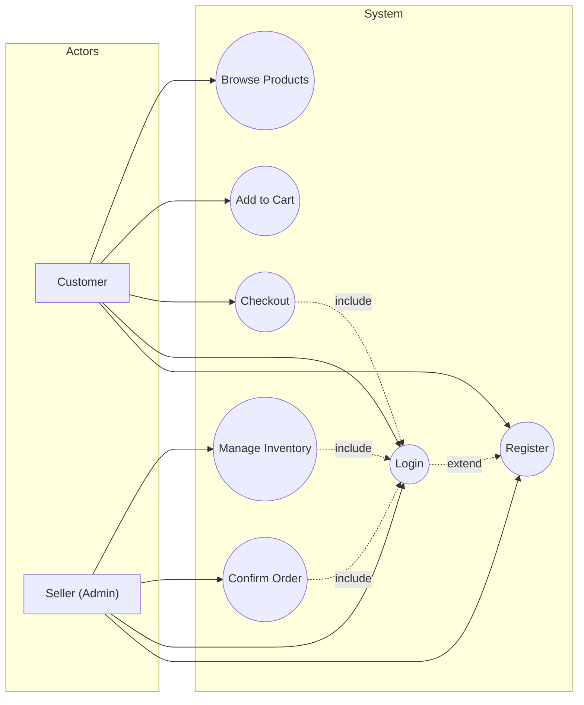
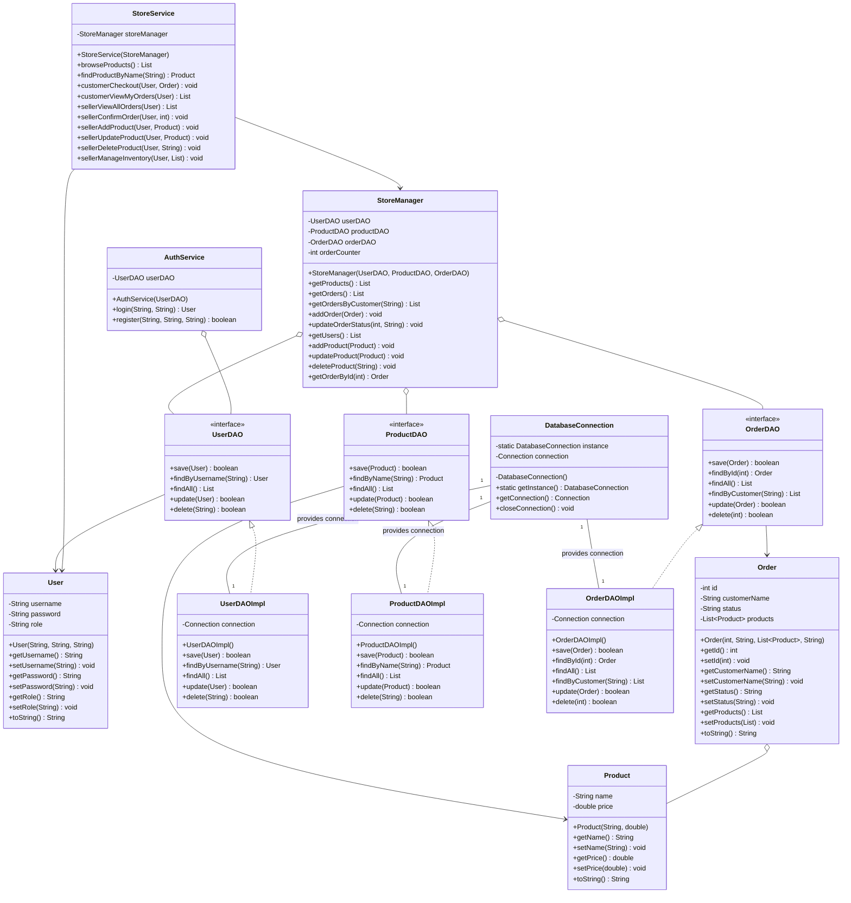
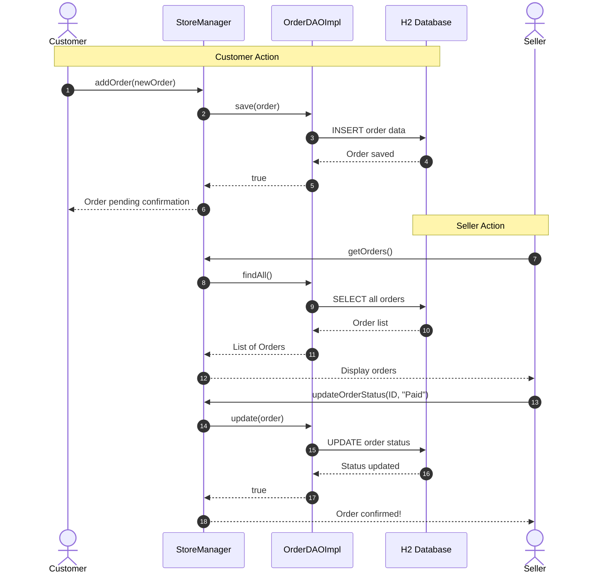

# Store Management System

This project is a simple console-based store management system written in Java. It allows customers to browse products, add them to a cart, and place orders, while sellers (admins) can manage inventory and confirm orders. All data is saved to a text file.

## Features
- User registration and login (Customer or Seller)
- Product catalog browsing
- Shopping cart and order placement for customers
- Inventory management and order confirmation for sellers
- Data persistence to a text file

## Architecture
- **StoreManager**: Repository layer - handles all data access operations through DAOs
- **StoreService**: Service layer with business logic - enforces role-based access control and application workflows
- **AuthService**: Authentication service - handles user login and registration with password hashing
- **StoreController**: Web controller layer (Javalin) - handles HTTP requests/responses and MVC routing
- **DAOs**: Data Access Objects - provide interfaces for database operations
- **DatabaseConnection**: Singleton pattern - manages single database connection instance
- **Views**: HTML templates rendered server-side with variables

## MVC Architecture
The application follows the Model-View-Controller (MVC) pattern:
- **Model**: User, Product, Order classes managed through DAOs
- **View**: HTML templates served by Javalin with variable substitution
- **Controller**: StoreController handles routing and business logic dispatch to StoreService

## Security Features
- Password hashing using BCrypt (12 rounds) for secure user authentication
- Role-based access control (Customer/Seller) enforced at service layer
- Session management for user authentication
- Form-based login/registration with validation

## How to Run
1. Make sure you have Java (version 21 or higher) and Maven installed.
2. Open a terminal in the project directory.
3. Build the project:
    ```bash
    mvn clean package
    ```
4. Run the application:
    ```bash
    java -cp target/umlproject-1.0-SNAPSHOT.jar com.github.arsenmonets.Application
    ```
5. Open your browser and navigate to `http://localhost:8080`

**UML Diagrams**

### Use Case Diagram

**Actors:**

- **Customer**: A user who can browse products, add them to the cart, place orders, and register/login to the system.
- **Seller (Admin)**: A user with administrative rights who can manage the product inventory, confirm orders, and also register/login.




### Class Diagram



### Sequence Diagram

**Scenario Descriptions:**

- **Customer scenario:**
    1. Customer initiates a purchase via the application.
    2. The application creates a new order and sends it to the StoreManager.
    3. StoreManager saves the order via OrderDAOImpl.
    4. OrderDAOImpl persists data to the H2 database.
    5. Application notifies the customer that the order is pending confirmation.

- **Seller scenario:**
    1. Seller initiates order confirmation via the application.
    2. Application requests the list of orders from StoreManager.
    3. StoreManager retrieves orders via OrderDAOImpl.
    4. OrderDAOImpl fetches data from the H2 database.
    5. Seller selects an order to confirm.
    6. Application updates the order status via StoreManager.
    7. StoreManager updates the order via OrderDAOImpl.
    8. OrderDAOImpl persists the update to the H2 database.
    9. Application notifies the seller that the order is confirmed.



## StoreManagerTest: Test Descriptions

1. **testRegisterAndLogin** — checks that a user can register and log in, and that the user's data is stored correctly.
2. **testRegisterDuplicate** — checks that it is not possible to register two users with the same username.
3. **testAddProduct** — checks that after adding a product, the number of products in the store increases by 1.
4. **testAddOrder** — checks that after adding an order, the number of orders in the store increases by 1.
5. **testUpdateOrderStatus** — checks that the status of an order can be changed (e.g., from "Pending" to "Paid").
6. **testGetUsers** — checks that it is possible to get the list of users and add a new user to this list.
7. **testProductToString** — checks that the toString() method in Product returns a string containing the product name.
8. **testOrderToString** — checks that the toString() method in Order returns a string containing the customer's name.
9. **testUserToString** — checks that the toString() method in User returns a string containing the username.
10. **testLoginFail** — checks that logging in with a non-existent user returns null (failure).